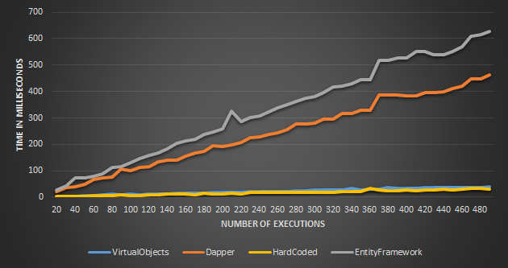

[](https://ci.appveyor.com/project/AlienEngineer/virtualobjects)

### Getting Started (Scaffolding)

[Short demonstration video] (http://screencast.com/t/CghgJTdmx#mediaDisplayArea)

```
# Creates the entity models based on data source and create a repository Layer.
Scaffold Models <server> <database> -Repository

or...

# Creates the entity models based on data source.
Scaffold Models <server> <database>

# Create a repository Layer.
Scaffold Repository

# Create a business Layer. (e.g. Scaffold Business Task)
Scaffold Business <ModelType>
```

****

### Getting Started (Manually)

#### Create a Model
```C#
public class Employee 
{
    public String EmployeeId { get; set; }
    public String LastName { get; set; }
    // Other fields ...
}
```
#### Config the Connection
```XML
  <connectionStrings>
    <clear/>
    <add name="YourMachineName" 
         providerName="System.Data.SqlClient" 
         connectionString="Data Source=.\instance;Initial Catalog=db;Integrated Security=true"/>
  </connectionStrings>
```
#### Use it!
```C#
   using (var session = new Session())
   {
      IQueryable<Employee> employees = session.GetAll<Employee>()
        .Where(e => e.BirthDate.Year > 1983);
      
      session.Insert(new Employee 
      {
         Name = "I'm the new guy!"
      });
   }
```


### Why
To improve myself and create something really easy to use with the best performance possible. This project started in college with ORMFramework and later VODB.

***

### Performance
Verified on unit-tests using NUnit on a intel i7 3.07GHz 18Gb RAM and intel i7-3537U 2.0GHz 8Gb RAM. On 06/08/2014.

* VO Version 1.3.18
* Dapper Version 1.27
* Entity Framework 6.1.1

#### Under Northwind Database
To obtain a fresh Graphic and more detail, execute the unit-test _Performance Check_. The excel will be filled on Bin\Performance\Session folder.
More graphics will be provided on /docs folder.

```MySQL
Select Count(*) from Suppliers
```

> Results from Laptop and PC were equal.

```MySQL
Select * from Suppliers
```
![Mapping Suppliers] (Docs/SuppliersMapping.png) 
> Results from intel i7-3537U 2.0GHz 8Gb RAM (4 core) Laptop

![Mapping Suppliers] (Docs/SuppliersMapping_pc.png) 
> Results from intel i7 3.07GHz 18Gb RAM (8 core) PC

***

### For more info click [here] (http://alienengineer.github.com/VirtualObjects/)
### Get it as a NuGet Package [here] (http://www.nuget.org/packages/VirtualObjects/)
```
   PM> Install-Package VirtualObjects
   PM> Install-Package VirtualObjects.Scaffolders
```


[](www.jetbrains.com)  
[](https://coderwall.com/alienengineer)  
[Ohloh](https://www.ohloh.net/p/VirtualObjects)

[Release notes] (https://github.com/AlienEngineer/VirtualObjects/releases)  
[What the future holds] (https://github.com/AlienEngineer/VirtualObjects/issues?milestone=1)  
[Known Bugs](https://github.com/AlienEngineer/VirtualObjects/issues?labels=bug&milestone=&page=1&state=open)
